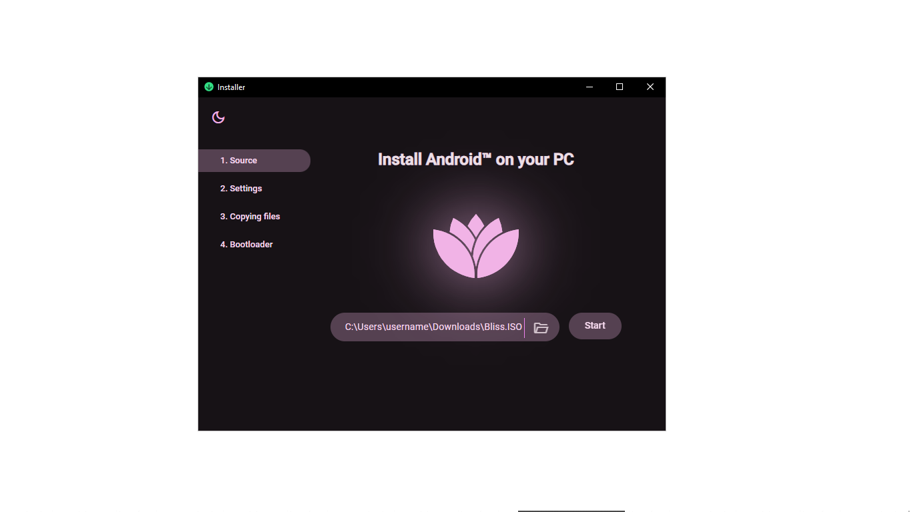

## Using Android-x86-installer
This is an installer maintained by the community and compatible with our recovery mode in newer builds.  
Download the .exe from https://github.com/Xtr126/Android-x86-installer/releases and double click to install it.
#### Step 1 -  Selecting a BlissOS .ISO file


#### Step 2 - Installation directory and size of user data image


#### Step 3 - Copying files and creating user data image 


#### Step 4 - Install GRUB Bootloader
Click on the button and wait for the User Account Control prompt from Windows. 

If administrative rights were obtained, a command prompt should appear:  


#### Uninstalling Bliss 
Right click on uninstall.bat in the installation directory and run as administrator.


### Linux
Ubuntu/Debian: Download the .deb file and run
```bash
sudo apt update
sudo apt install ./path/to/filename.deb
```
Fedora and RPM distros: Download the .RPM file and run
```
rpm -ivvh ./path/to/package_name.rpm
```
Arch Linux: Get it from the AUR
```bash
git clone https://aur.archlinux.org/android-x86-installer-tauri-bin.git
cd android-x86-installer-tauri-bin
makepkg -si
```
Other distros: Download the .AppImage, grant it executable permission and double-click on it to run.
```bash
chmod a+x ./<path to AppImage>
```
