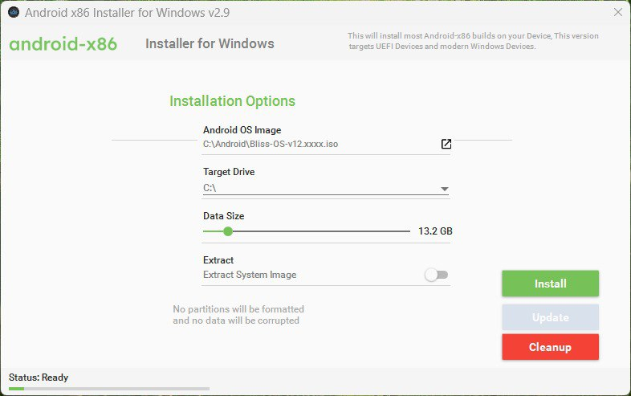
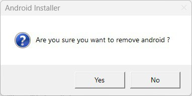
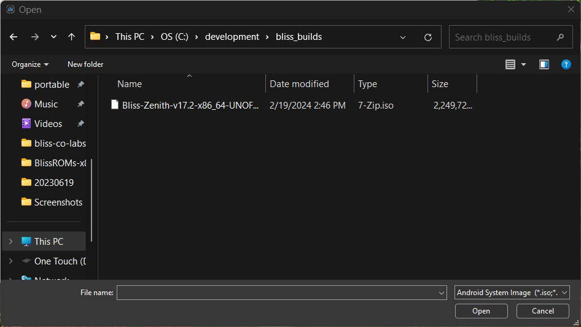
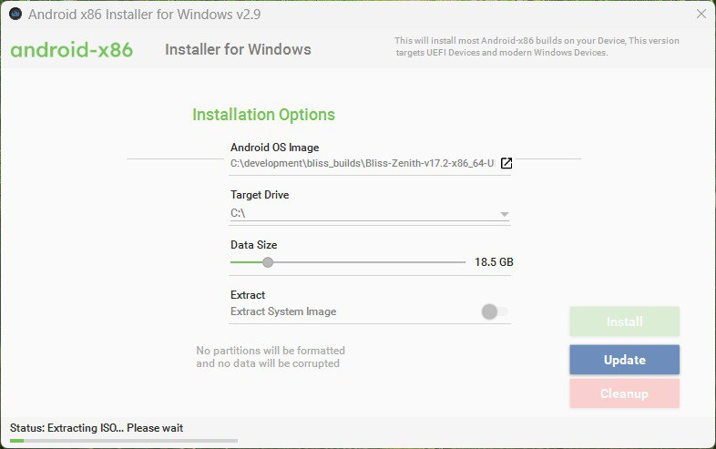
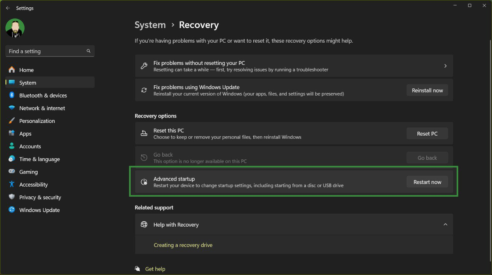

## Using the Windows Installer

We maintain an installer for Windows, but we still reccommend using the standard EFI install method from our bootable USB in order to take advantage of the stability, security and updatability of Bliss OS builds. 

#### Downloading the installer

Start off by heading to the github repo for the installer and downloading the latest .exe usually found in the /bin/make_installer folder of that repo. 
https://github.com/BlissRoms-x86/Androidx86-Installer-for-Windows/tree/2.9.0.1/bin/make_installer

There is an .exe file in there named Androidx86-Installv29.0000.exe. That is the one you will need to grab. Save it to your Computer along with the latest Bliss OS/Bass .iso you wish to install along side Windows. 

#### Installing Android

When you launch the application, the UI is mostly self explanitory, but just in case, we will run through the steps here with you.

If you have a pervious install attempt that did not work for Bliss, Remix OS, Prime OS, etc. We reccommend that you use the **Cleanup** option first before installing. This will help avoid any configuration or installation issues. This step will ask for verification, and confirm with a dialog when complete. 

 

From here, we can relaunch the installer or continue using it, and select the .iso by clicking the icon to the right of the **Android OS Image** field. This will open a Windows File Explorer window and let you navigate to your download and select the .iso. 

From here, we can select the **Target Drive**, and then drag the **Data Size** slider to the space we want to use for our data.img (Android Data partition). 

(**!!PLEASE NOTE!!**): The **Extract** option is only useful for users that want to be able to remount the system as RW. We provide an immutable root method (KernelSU) in all recent Bliss builds, so this option can be ignored. 

When you are done setting up the build, go ahead and click the **Install** button. 
The process of the install will display at the lower lefthand side of the app window. 

When complete, the installer will popup a dialog stating so. 

#### Rebooting into Android

In order to reboot into Android, we start off by entering Settings, and navigating to the System tab on the left, and scroll down, selecting **Recovery** on the right.

In the **Recovery** tab, you want to find the **Advanced startup** option, and click the **Restart now** button. 

This will restart your PC into the Advanced Startup menu. You want to select the **Use a device** option

Followed by the **Android OS** option

From here, your PC should reboot into Grub, and display the Grub menu for the .iso you installed

