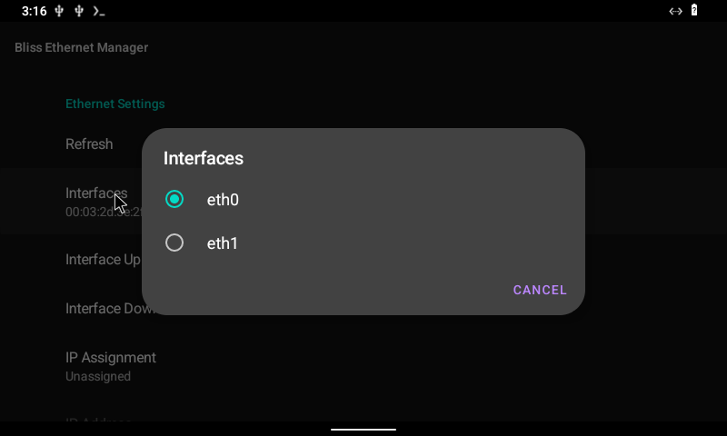
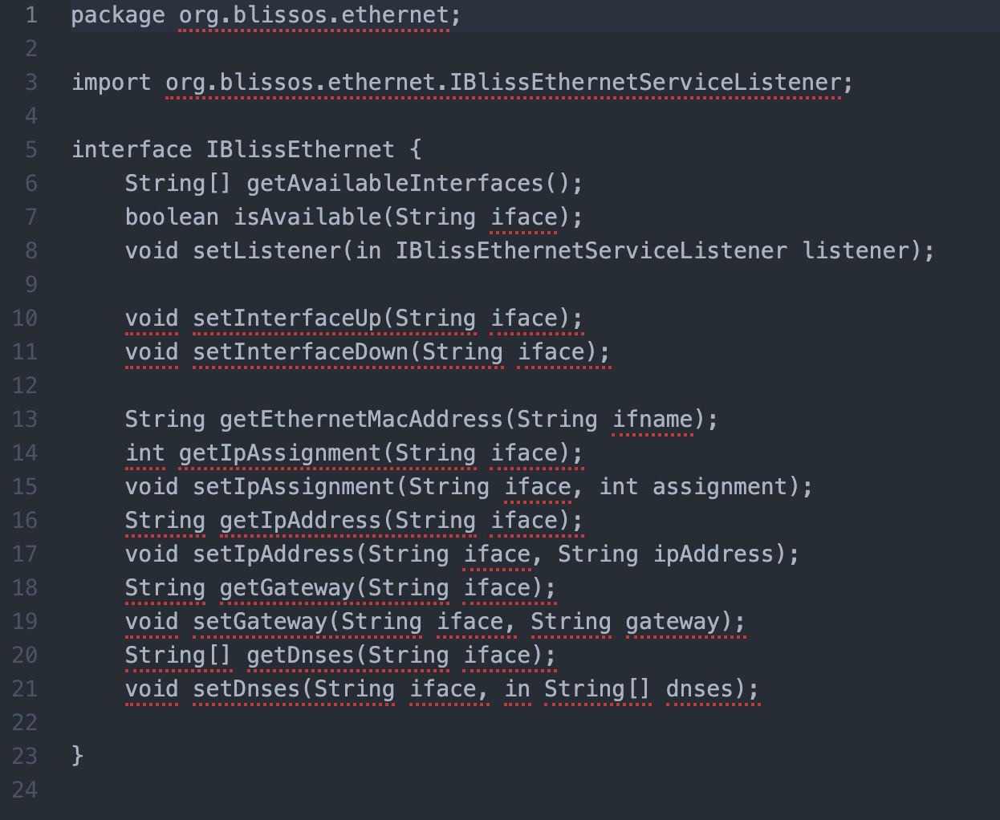
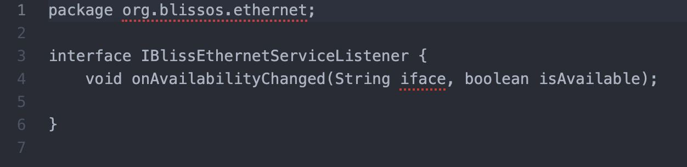

# BlissEthernetManager

## Setting Up Ethernet Interfaces

If your version of BlissBass comes with the Eternet Manager, then you are able to setup multiple ethernet interfaces and configure them. 


Clicking on the Interfaces item allows you to select the target Ethernet interface to view/edit. You may need to click the refresh button at the top for changes to be reflected. 





From there, you can set the interface as Up/Down, Unassigned/DHCP/Static, and depending on selection, you can set the interface IP, Gateway and DNS. 


* **IP and Subnet mask** are handled in the IP Address field (&lt;IP Address>/&lt;Subnet Mask>)
* **Gateway Address** is handled through the Gateway Address field
* **DNS** is handled through the DNS Addresses field


### Bliss Ethernet Manager AIDL Interface:

The source package for BlissEthernet Manager contains the framework and system libs for the AIDL interface. 

Gradle:


```
implementation fileTree(dir: 'system_libs/', include: ['*.jar'])
```


Java: 


```
BlissEthernetManager blissEthernetManager = BlissEthernetManager.getInstance(<Context>); 
blissEthernetManager.*
```


AIDLs:








### Bliss Ethernet Manager ADB Interface:

We also supply a simple interface using the service framework provided by Android that allows you to set **IP**, **DNS**, and **Gateway.**

ADB Interface:


```
adb shell service call blissethernet <code> <parameters>
```


**&lt;code>** is the method number in aidl 

1: getAvaliableInterfaces 

2: isAvaliable 

3: Etc…

Examples:


1. getAvaliableInterfaces: 
2. `x86_64:/ # service call blissethernet 1 s16 eth0 Result: Parcel( 0x00000000: 00000000 00000002 00000004 00740065 '............e.t.' 0x00000010: 00300068 00000000 00000004 00740065 'h.0.........e.t.' 0x00000020: 00310068 00000000 'h.1..... ')`
3. isAvaliable:
4. `x86_64:/ # service call blissethernet 2 s16 eth0 Result: Parcel(00000000 00000001 '........')`