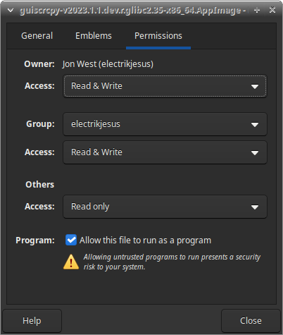
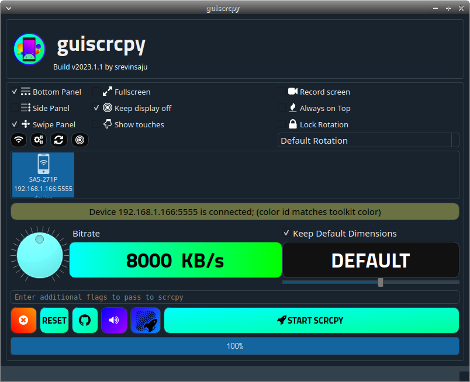
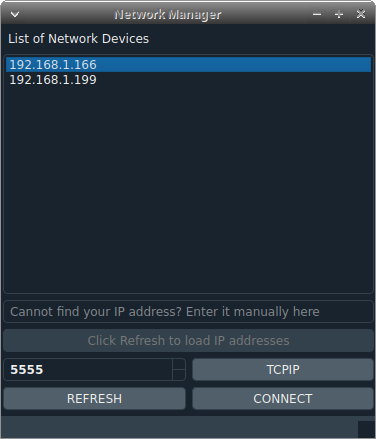
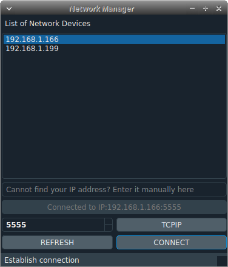
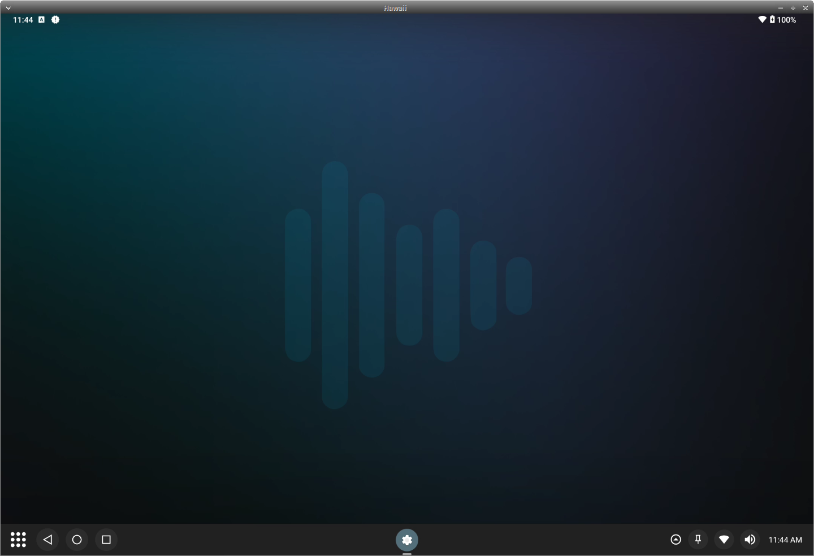
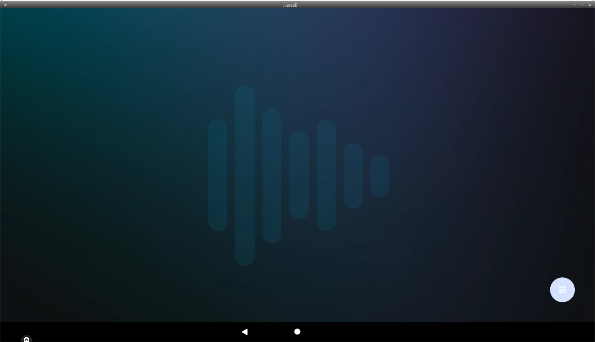

# Using Scrcpy For Remote Management

scrcpy is a popular open-source tool that allows remote access and control of your Android device using adb interface. 

It comes in a number of forms:

**scrcpy:**
- https://github.com/Genymobile/scrcpy

**guiscrcpy:**
- https://github.com/srevinsaju/guiscrcpy

**qtscrcpy:**
- https://github.com/barry-ran/QtScrcpy

## Installing guiscrcpy:

This guide will run through using the guiscrcpy tool. We will start off by navigating to the latest [releases](https://github.com/srevinsaju/guiscrcpy/releases/tag/v2023.1.1) page and downloading the "guiscrcpy-vXXXX.X.X.dev.r.glibcX.X-x86_64.AppImage" file as it contains all the required dependencies to run on most setups. 

Once downloaded, you will want to set executable permissions for the AppImage file by right-clicking, selecting Properties, and checking the box next to **Allow this file to run as an executable**, then you can close the dialog.

## Main Program:

Launching the AppImage will load to display the main GUI:

### Connecting to a device:

To connect to a new device, start by clicking on the **wireless icon** under the options panel. From there, you can hit the **refresh** button to display any devices broadcasting ADB on the network, or you can type in the IP directly and tap the **Connect** button to connect to that device. 

Once a device is connected, it will show the status in the grey textbox like below:

From here, we can close the window and continue to the next steps. 

### Remote operation of the device

Once we are connected, you can select the **Start Scrcpy** button to remote into the device

You can use your mouse and keyboard to operate the device, or you can use the button tools provided by guiscrcpy (moving those out of the main interaction area first). 

#### Connecting to secondary display:

In order to remote into the connected displays on the device, this requires us to use the "additional flags" preferences from within guiscrcpy, adding `--display #` where `#` is the display ID for your target display. 

Example:

After adding `--display 2`, we can click the **Start Scrcpy** button and it will remote into the secondary display connected to the device. 

## Other Options:

You can configure the options further by using the "additional flags" textbox. A good reference for the possibilities is the [official scrcpy documentation](https://github.com/Genymobile/scrcpy?tab=readme-ov-file#user-documentation). 

